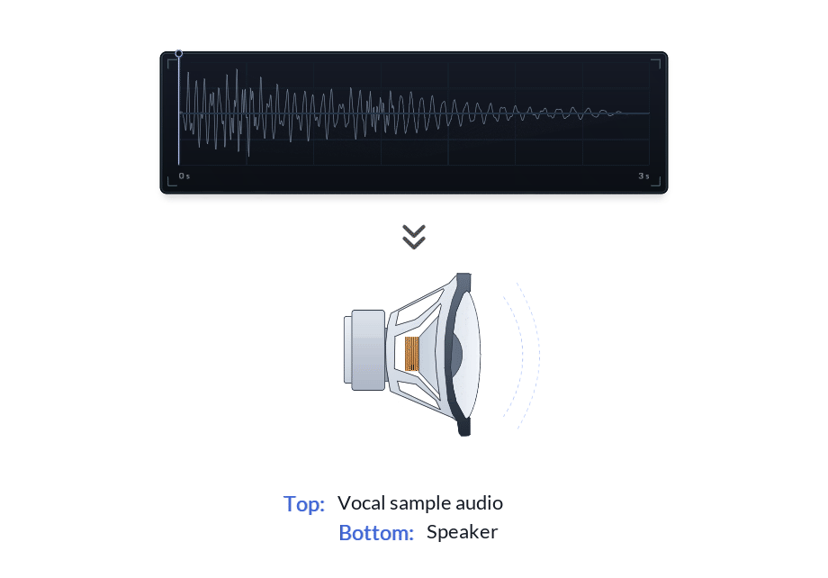
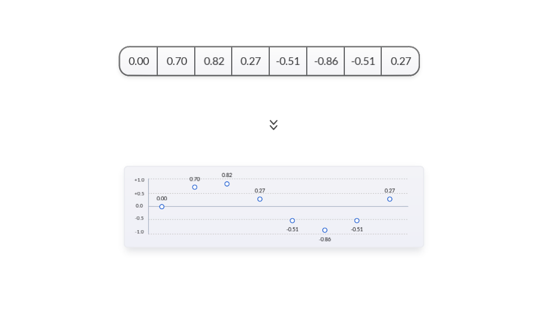
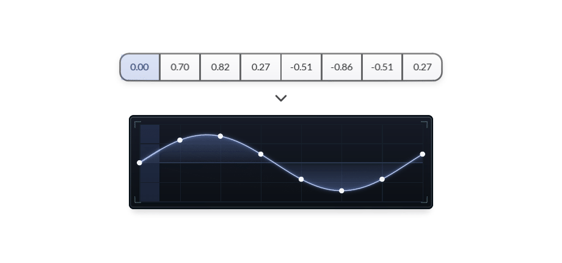
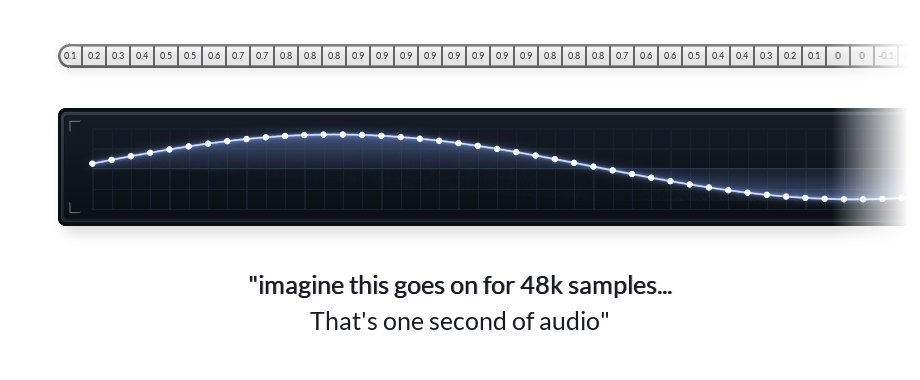
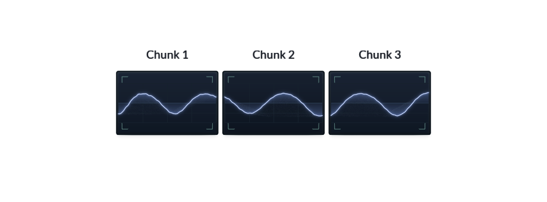
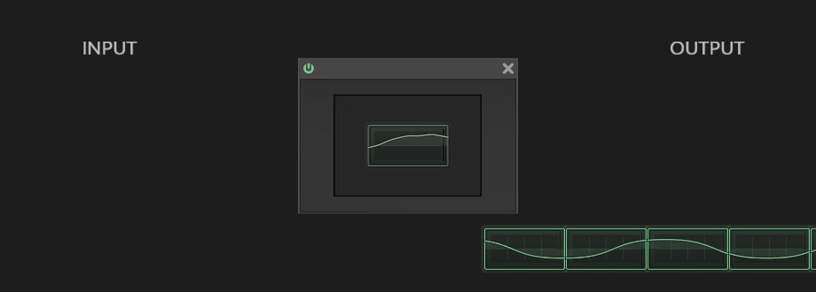
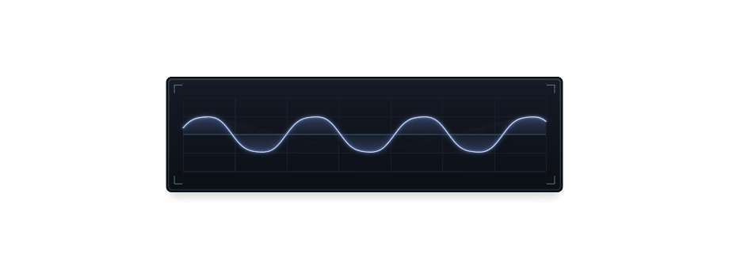
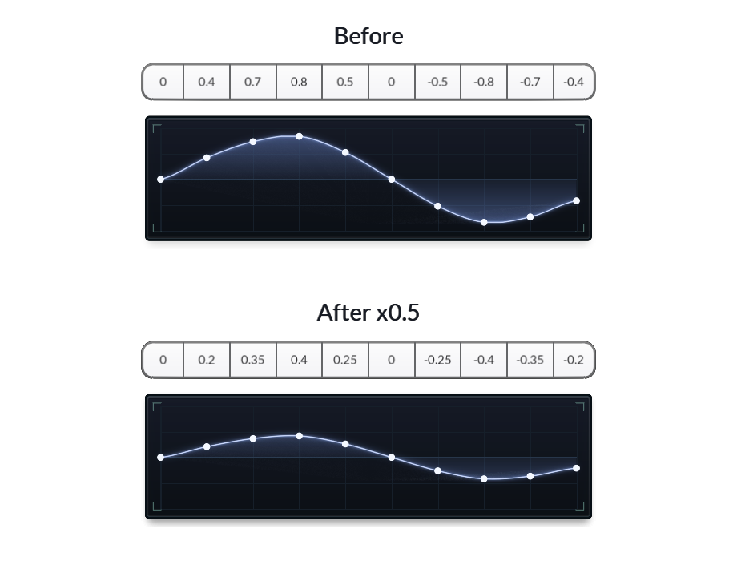
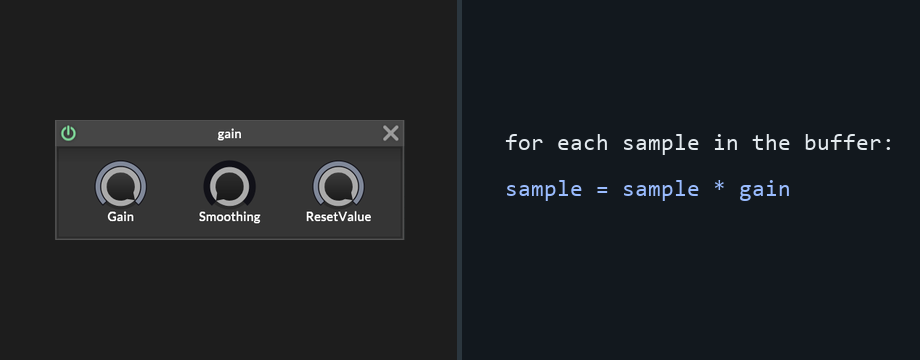
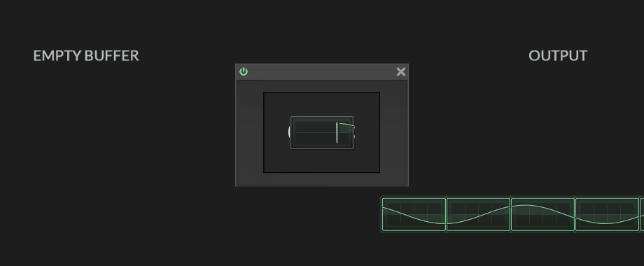

Hi HISE forum!

I'm starting a small series on how DSP works in HISE, aimed at people who want to get into C++ DSP nodes but still find the theory a bit slippery.

This first one is deliberately basic. If you already know what samples and buffers are, you can probably skim it. But I want the series to start from the same mental picture before we get into callbacks, custom nodes, and actual C++ processing code.

The whole idea is simple: HISE is not handing your DSP code a mysterious object called "sound". It is handing it numbers. More specifically, it is handing it small blocks of numbers, over and over again. Those blocks are buffers.

## Sound is movement first

Before getting into buffers, it helps to start with the physical thing we are trying to control. A speaker makes sound by moving air. If the cone moves forward, the air pressure rises. If it moves back, the air pressure falls. Do that fast enough and we hear it as sound.

A waveform is just a way of drawing that movement over time.

The top panel is the waveform, and the speaker below is following it. This example is intentionally slow and tidy. Real audio does not move this politely, but the relationship is easier to see at this speed.

Real audio is usually much messier than a tidy teaching wave:

Even here, the important idea has not changed: the speaker is following a changing value.

## A waveform becomes numbers

A computer does not store a smooth curve directly. It stores measurements of that curve.

Each measurement is called a **sample**.

Here is a tiny teaching example with only eight samples. The values are rounded so the table stays readable:

Read the numbers from left to right and you get the shape of the waveform. Positive numbers move the speaker one way, negative numbers move it the other way, and zero is the centre position.

The table and the drawing are the same data. The table is the machine-friendly view; the drawing is the human-friendly view.

This is the first important bit: digital audio is a stream of sample values.

## Real audio is the same thing, just dense

The eight-sample waveform above is obviously a toy example. At a sample rate of 48 kHz, one second of mono audio contains 48,000 sample values.

Stereo is two streams of that. So when we talk about "the waveform" inside a computer, we are really talking about a long list of numbers changing very quickly.

No special magic yet. Just an unreasonable amount of numbers.

## HISE works on chunks of that stream

In offline code, you might load an entire audio file into memory and process the whole thing at once. Real-time plugin DSP does not usually work like that.

HISE gives your effect a short run of samples, your effect processes that run, and then HISE gives it the next run.

Those short runs are called **buffers**. In this diagram I label them as chunks, because that is the most direct visual idea: a buffer is a chunk of the waveform.

The chunk edges are not musical. They do not care where the waveform peaks, where it crosses zero, or where a cycle starts and ends. They are just how the audio engine packages the work.

This is the same idea shown as a process.

1. A buffer arrives.
2. The DSP code changes the numbers inside it.
3. The processed buffer joins the output stream.
4. The next buffer arrives.

That repeated handoff is the basic rhythm of real-time DSP.

## Gain is the simplest version

Let's use gain as the first effect, because it is the easiest one to understand.

In HISE, this might look like a Gain node:

A Gain node has controls around it, but the core DSP idea is small: multiply every sample by a gain value.

You already know the result by ear. Lower gain means quieter sound. On the waveform, that means the same shape becomes shorter.

If the gain is `0.5`, every sample becomes half as tall.

Nothing mysterious happened. The waveform kept the same shape, but all the values moved closer to zero.

As pseudocode, the heart of the node looks like this:

If `gain` is `1.0`, the samples stay the same. If `gain` is `0.5`, the waveform becomes half as tall. If `gain` is `0.0`, every sample becomes zero, which is silence.

That is DSP coding at its simplest: change the numbers, and the sound changes.

## Other effects are still buffer work

Once you see a buffer as a list of numbers, lots of effects become less mysterious.

Gain multiplies the numbers. Distortion bends the numbers. Delay stores numbers and plays them back later.

An oscillator is the same idea turned around. Instead of receiving an existing waveform and modifying it, it writes a new waveform into the buffer.

Here is the oscillator version of the same block-processing picture. The incoming buffer is empty, the DSP node writes sine-wave samples into it, and the result becomes the output.

That is the foundation for this series. Audio effects are little machines that receive numbers, change numbers, and send numbers onward.

Next time we can start asking the more interesting question:

If sound is only numbers, how do those numbers create tone, frequency, and spectrum?
