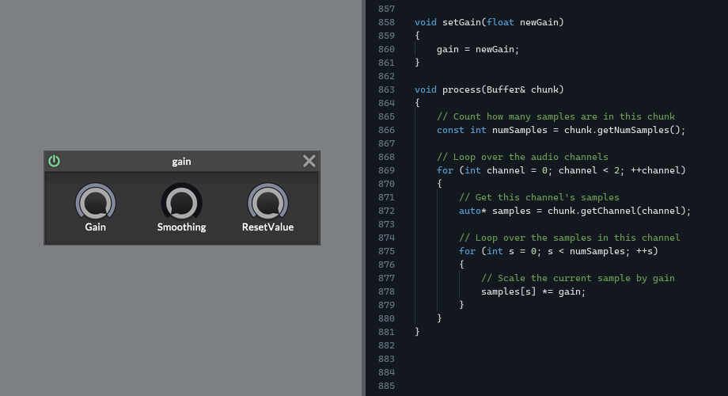
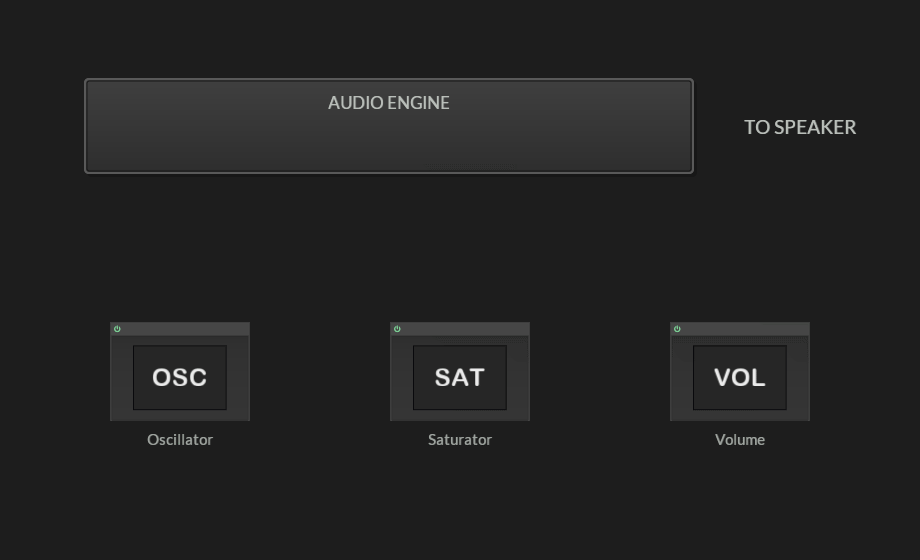
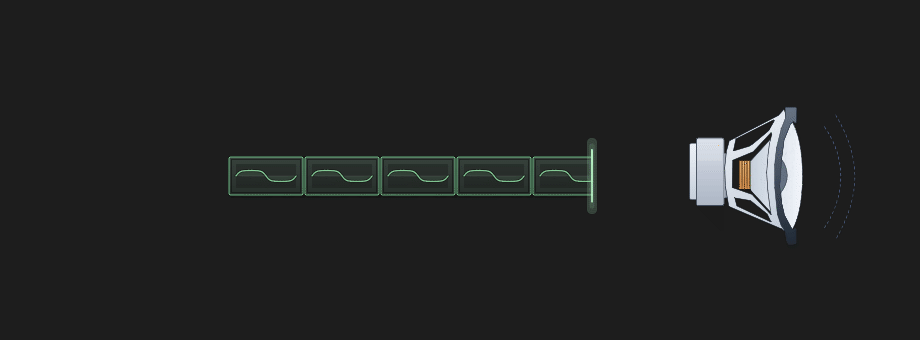

DSP can seem like a black box to a beginner.

Sound goes in.
Code happens.
Different sound comes out.

But it will all make sense if you understand one simple thing:
a speaker makes sound by moving.


A speaker makes sound by moving.
The line at the top is a waveform.
For now, think of it as the shape the speaker is following.
When the waveform moves up, the cone moves one way.
When the waveform moves down, the cone moves the other way.

That movement pushes air, and we hear it as sound.

The first graphic is simplified so the motion is easy to see.

Real audio is faster and messier,
but the rule does not change:

the speaker is following a changing value over time.


## The waveform as numbers

If we want to create a sound, we need to create a waveform.

In digital audio, the shape is stored as numbers.
A tiny piece of a waveform might look like this:

```text
[0.00,  0.70,  0.82,  0.27,  -0.51,  -0.86,  -0.51,  0.27]
```

Digital audio does not store the picture.
It stores the heights.
Plot those heights from left to right, and the waveform appears.


These height numbers are called samples.
Because each number is one tiny “sample” of the waveform height at one moment in time.

The order matters because the order is time:
The array is the waveform data. The drawing is the same data made easier to see.


## Lots of samples

The example above is tiny on purpose.
Real audio has far more samples than this.

I’m sure you’ve heard of “Sample rate”.
Well, running a program at 48 kHz means that one second of mono audio contains 48,000 sample values.
That’s the kind of high resolution that produces smooth waves.
The simple drawings in this article are just a readable version.
But real audio is the same thing packed more tightly in time.


So far, we have looked at audio as one long strip of sample values.

But we have not talked about how a plugin generates this big long stream of audio.

## Chunks (Buffers)

Real time DSP does not work a big, long, sound in one go.

- It processes chunks of audio.


A DSP effect takes a short chunk of audio, processes it, then moves on to the next chunk.

An effect is like this:
A chunk comes in.
The effect changes the numbers inside it.
The chunk goes out.
Then the next chunk comes in.
This is the basic shape of a normal audio effect.


The reason we process in small chunks of sound is efficiency related.
But it’s also practical.
It’s useful to have access to a portion of audio at a time. (for particular audio effects).

## A simple example: volume

Let’s look at a real-life example.
Volume is a good example because it’s easy to see.


You probably already know:
Volume is the height of the waveform.
Making a waveform less tall means the speaker isn’t moving as much.
Height affects volume.


…And earlier we saw that we store waveforms as height values.

(you can see where I’m going with this).

All we need to do is make the sample values smaller.
For example if we multiply every sample by 0.5 (half):
The shape is the same.
The height is half as large.


The algorithm for a volume effect boils down to:


In pseudocode form:

```cpp
- receive buffer
for each sample in the buffer
{
    sample = sample * gain;
}

- do the above for every buffer we receive
```

If gain is 1.0, the sample values stay the same.
If gain is 0.5, the waveform is half as tall.
If gain is 0.0, every sample becomes zero, which is silence.

In actual C++ DSP:



(^ I bet you understand this now!)

The main part of the effect is a function that receives a buffer of samples (a chunk) and processes them using math.
This is what actual DSP code looks like!
The real HISE gain node has some extra controls and parameter smoothing, but the core audio operation is still this simple multiplication.

## The Lesson

Honestly that’s pretty much it.
DSP is not very complicated.
Most Audio effects work by:
Take a buffer of sample values,
change those values,
and pass the buffer onward

```text
A Gain effect multiplies the samples.
```

```text
A Distortion bends the waveform shape by changing the samples.
```

```text
A Delay stores samples and plays them back later.
```

Oscillators are slightly different. They create new sample values rather than affecting incoming ones.


^ Well, I’m if being 100% honest, this isn’t quite the whole picture.

If we zoom out a little, you’ll see that it’s actually a loop, where something is asking our DSP for samples. And we can give it whatever we want.

For an effect, something is going to send us a chunk and say “please process this” and we do that, then it takes it back.

For an oscillator, we might we given an empty chunk and we just need to write a waveform into the chunk and send that back.

But it’s also possible we will be given a chunk that already has some existing audio data in it (for example it might contain other synth voices that have already been added from an oscillator somewhere else). In which case we just need to add our oscillator waveform ontop of that without erasing the existing data.

Anyway, that’s getting ahead of myself! You’ll see how that works soon enough when we get into some real dsp coding in the next article.

Some of these things are best learnt by just doing it.

## Recap

1. the table, the waveform, the buffer.
These are not separate ideas.
They are different views of the same thing:
sample values over time.

2. Audio plugins work by processing chunks of samples that are passed around between different oscillators and effects.



Down the line, part of the program will mix the chunks and send them to the speaker and we will hear the waveform (we don’t usually have to worry about that part, Hise or Juce will take care of those parts for us)


